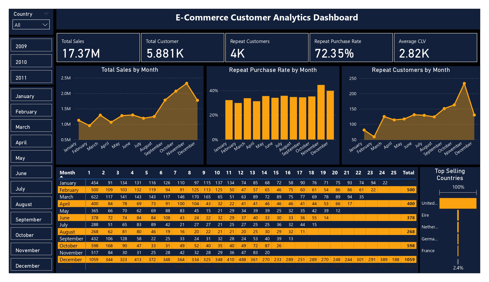
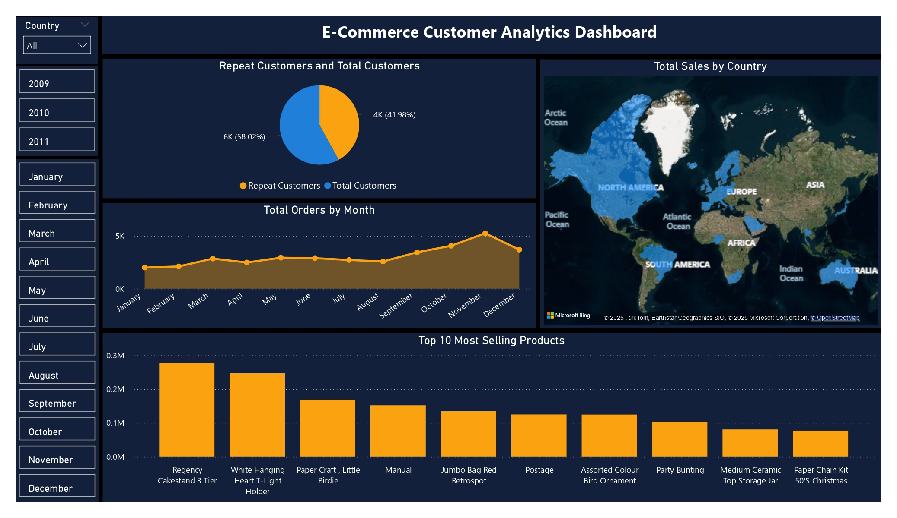

# E-Commerce Customer Analytics Dashboard

## Overview
This repository contains a comprehensive data analysis project focused on e-commerce customer behavior and sales performance. The project includes data processing scripts, a detailed dashboard, and actionable insights and recommendations derived from the analysis of online retail data spanning 2009–2011. The dashboard, built using Power BI, visualizes key metrics such as total sales, customer retention, repeat purchase rates, and geographic trends, providing a robust foundation for business decision-making.

## Business Scenario
The objective of this project was to perform an **E-Commerce Customer Analysis** with the following goals:
- Identify **Customer Lifetime Value (CLV)** to assess long-term customer value.
- Analyze **Repeat Purchase Rates** to evaluate customer retention and loyalty.
- Explore **Product Sales Trends** to understand purchasing patterns and popular items.
- **Key Skills Demonstrated**: Cohort analysis, segmentation, retention analysis.

## Tools & Technologies
- **SQL**: For data creation, import, and cleaning.
- **Excel**: For initial data exploration and calculations.
- **Power BI**: For dashboard development and visualization.
- **CSV Files**: For raw and processed datasets.

## Project Structure
- **`create_import_merge_online_retail_ii.sql` (1.08KB)**: SQL script for creating, importing, and merging the raw dataset.
- **`data_cleaning_online_retail_ii.sql` (2.63KB)**: SQL script for data cleaning and preprocessing.
- **`Insights_and_Recommendations.pdf` (86.39KB)**: Detailed report summarizing key insights and strategic recommendations.
- **`online_retail_II_2009_10.csv` (41.79MB)**: Raw dataset for 2009–2010.
- **`online_retail_II_2010_11.csv` (42.92MB)**: Raw dataset for 2010–2011.
- **`online_retail_II_dashboards.pbix` (9.52MB)**: Power BI file containing the interactive dashboard.
- **`online_retail_II_dashboards_page-1.jpg` (1.00MB)**: Screenshot of dashboard page 1.
- **`online_retail_II_dashboards_page-2.jpg` (765.85KB)**: Screenshot of dashboard page 2.
- **`online_retail_II_merged_cleaned.csv` (81.28MB)**: Processed and merged dataset after cleaning.

## Dataset Info
The analysis is based on the **Online Retail II** dataset. This dataset contains transactional data from an online retail store between 2009 and 2011, including:
- **Source**: [UCI Machine Learning Repository](https://archive.ics.uci.edu/dataset/502/online+retail+ii).
- **Time Frame**: 2009–2011.
- **Content**: Records of customer transactions, including invoice numbers, stock codes, descriptions, quantities, invoice dates, unit prices, customer IDs, and country information.
- **Size**: Approximately 1M+ records across multiple CSV files.

## Key Features
- **Dashboard Highlights**:
  - Total Sales: $17.37M with seasonal spikes in Q4 (Oct–Dec).
  - Total Customers: 5.88K, with 4K repeat customers (72.35% repeat purchase rate).
  - Average Customer Lifetime Value (CLV): $2.82K.
  - Geographic Insights: Top sales from the UK, with untapped potential in Germany, Netherlands, France, and Eire.
  - Product Trends: Top sellers are giftware and decorative items (e.g., Regency Cakestand 3 Tier, White Hanging T-Light Holder).
- **Visualizations**:
  - Line chart for Total Sales by Month.
  - Bar chart for Repeat Purchase Rate by Month.
  - Area chart for Repeat Customers by Month.
  - Pie chart for Repeat vs. Total Customers.
  - World map for Total Sales by Country.
  - Bar chart for Top 10 Most Selling Products.

## Dashboard Preview  
Here are sample previews of the **interactive dashboards** built in Power BI:  

  

## Insights
1. **Sales Performance**: Peak sales in December, confirming holiday-driven demand.
2. **Customer Base**: Strong repeat customer base (72.35%) suggests good loyalty.
3. **Cohort Analysis**: Holiday cohorts (Nov–Dec) show higher short-term retention but weaker long-term behavior.
4. **CLV**: Holiday cohorts have higher short-term CLV, while non-holiday cohorts sustain long-term value.
5. **Geographic Trends**: UK dominates, with international potential remaining untapped.
6. **Product Sales**: Best-sellers align with holiday seasonality, indicating festive demand dependency.

## Recommendations
1. **Customer Retention & Cohort-Specific Strategies**:
   - Focus on bundled offers and upselling for holiday cohorts.
   - Run retargeting campaigns during the next holiday season.
   - Nurture non-holiday cohorts with loyalty programs and personalized recommendations.
2. **Seasonality Management**:
   - Strengthen inventory and logistics in Q4.
   - Launch pre-holiday promotions (Sep–Oct) to spread sales.
3. **Marketing Optimization**:
   - Allocate budget strategically for high-retention cohorts.
   - Use RFM segmentation for customer classification.
4. **Geographic Expansion**:
   - Scale in Germany, Netherlands, France, and Eire with localized campaigns.
5. **Product Strategy**:
   - Double down on best-sellers with complementary products.
   - Create seasonal collections to maximize holiday cohorts.

## Usage
1. Clone the repository: `git clone <https://github.com/Jamil611/E-commerce-Analytics-Dashboard>`.
2. Import the `.sql` files into a SQL database (e.g., MySQL, PostgreSQL) to replicate the data processing steps.
3. Open `online_retail_II_dashboards.pbix` in Power BI to explore the interactive dashboard.
4. Review `Insights_and_Recommendations.pdf` for detailed findings and strategic guidance.

## Connect with Me  
I’m always open to networking, collaboration, or discussing exciting data opportunities.  

## License  
This project is licensed under the **MIT License**.